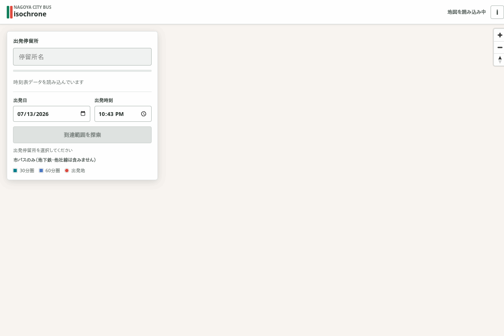
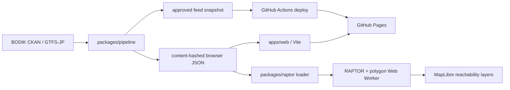

# Isochrone

Isochrone is a static web map for Nagoya City Bus timetable searches. It shows the areas reachable
within 30 or 60 minutes from a stop and the latest time each stop can be left to reach a destination
by a deadline. It runs pattern-based RAPTOR and map processing in the browser, so the deployed
application does not require an application server.

Public application: [https://taku335.github.io/isochrone/](https://taku335.github.io/isochrone/)



The Phase 1 scope is Nagoya City Bus only. Subway, railway, other bus operators, live delays, and
service disruptions are not included. Results are estimates derived from the published timetable.

## Features

- Search Nagoya City Bus stops by name or kana and group poles with the same stop name.
- Start from any map point or the browser's current location, connecting on foot to stops within
  800 metres through a spatial index built when the stop dataset loads.
- Select a service date and departure time while correctly handling GTFS trips whose source times
  extend past 24:00.
- Move departure time in five-minute steps and refresh the reachable area with debounced Worker
  queries.
- Run one-to-all earliest-arrival RAPTOR in a Web Worker.
- Draw 30-minute and 60-minute reachable polygons with walking transfers.
- Run reverse RAPTOR for arrive-by searches and label stops with their latest departure time.
- Share the selected stop or map point, date, time, and debug view in the URL.
- Display the source feed version, validity period, service-day layers, and CC BY 4.0 attribution.

## Requirements

- Node.js 22, as specified by `.nvmrc`
- pnpm 10.13.1, as specified by `packageManager`
- Git

Docker Desktop or another Docker Compose implementation can replace the local Node and pnpm
requirements.

## Local development with pnpm

From a clean clone:

```sh
git clone https://github.com/taku335/isochrone.git
cd isochrone
corepack enable
corepack prepare pnpm@10.13.1 --activate
pnpm install --frozen-lockfile
pnpm --filter @isochrone/pipeline cli download nagoya-cbus
pnpm --filter @isochrone/pipeline cli validate nagoya-cbus
pnpm --filter @isochrone/pipeline cli dataset nagoya-cbus
VITE_DATASET_MANIFEST_URL="/@fs$PWD/.cache/web-data/nagoya-cbus/manifest.json" \
  pnpm --filter @isochrone/web dev
```

Open [http://127.0.0.1:5173/](http://127.0.0.1:5173/). Stop the server with `Ctrl-C`.

Run the repository checks with:

```sh
pnpm lint
pnpm typecheck
pnpm test
```

## Local development with Docker

The Docker path writes generated data into the Vite public directory, which is ignored by Git:

```sh
git clone https://github.com/taku335/isochrone.git
cd isochrone
docker compose build
docker compose run --rm pipeline download nagoya-cbus
docker compose run --rm pipeline validate nagoya-cbus
docker compose run --rm pipeline dataset nagoya-cbus \
  --out-dir ../../apps/web/public/data
docker compose up web-dev
```

Open [http://127.0.0.1:5173/](http://127.0.0.1:5173/). Use `docker compose down` when finished.

## Production build

Generate the deploy data and build with the repository base path:

```sh
pnpm --filter @isochrone/pipeline cli download nagoya-cbus
pnpm --filter @isochrone/pipeline cli validate nagoya-cbus
pnpm --filter @isochrone/pipeline cli dataset nagoya-cbus \
  --out-dir ../../apps/web/public/data
VITE_BASE_PATH=/isochrone/ pnpm --filter @isochrone/web build
```

The output is in `apps/web/dist`. `.github/workflows/deploy.yml` performs the same process on each
push to `main`, verifies that CKAN matches the approved feed snapshot, and deploys the artifact to
GitHub Pages.

## Architecture



| Path | Responsibility |
| --- | --- |
| `packages/gtfs-types` | Shared browser dataset types |
| `packages/pipeline` | CKAN download, GTFS parsing, compaction, validation, and dataset output |
| `packages/raptor` | Dataset loader, service-day layers, RAPTOR, walking transfers, and polygons |
| `apps/web` | Vite application, stop search, URL state, MapLibre rendering, and worker entry point |
| `config` | Agency configuration, smoke cases, and approved feed snapshots |
| `.github/workflows` | CI, Pages deployment, and weekly feed update review |

The browser dataset uses compact structure-of-arrays JSON. `manifest.json` points to immutable
`stops-<contenthash>.json` and `timetable-<contenthash>.json` files. The pipeline enforces a 1.5 MB
combined gzip limit.

## Configuration

| Variable | Default | Purpose |
| --- | --- | --- |
| `VITE_DATASET_MANIFEST_URL` | `<base>/data/manifest.json` | Override the browser dataset manifest |
| `VITE_MAP_STYLE_URL` | OpenFreeMap Liberty | Replace the MapLibre style |
| `VITE_BASE_PATH` | `/` | Set the Vite deployment base, such as `/isochrone/` |

The configured map style must provide the required OpenMapTiles and OpenStreetMap attribution.

## Operations and future work

- [Operations runbook](docs/OPERATIONS.md): automatic and manual feed updates, timetable revision
  review, rollback, deployment checks, and the PMTiles migration path.
- [Phase 2 design](docs/PHASE2.md): the implemented reverse RAPTOR and latest-departure contracts.
- [Development plan](docs/PLAN.md): constraints, data format, milestones, and design history.

## Data attribution

The application uses [Nagoya City Transportation Bureau City Bus GTFS-JP data](https://data.bodik.jp/dataset/231002_7109030000_bus-gtfs-jp)
under [CC BY 4.0](https://creativecommons.org/licenses/by/4.0/deed.en).
