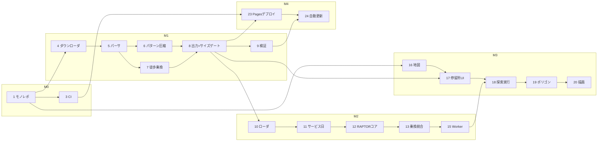

# 名古屋市バス到達圏マップ 開発計画

指定した停留所から名古屋市営バスで 30 分 / 60 分以内に到達できる範囲を地図上に描画する、完全静的な Web アプリケーション(GitHub Pages ホスティング)の開発計画。

- データソース: 名古屋市交通局 市バス GTFS-JP(BODIK CKAN 経由、CC BY 4.0)
- サーバーサイド処理なし。前処理済みデータ + ブラウザ内経路探索(RAPTOR)+ ブラウザ内ポリゴン生成
- フェーズ 1 のスコープ: 市バスのみ・最早到着(earliest arrival)・出発時刻指定
- フェーズ 2(将来): 「終電・終バス逆算」= 目的地に間に合う最遅出発時刻の逆方向探索。**本計画のエンジン設計はフェーズ 2 への拡張点を最初から織り込む**(→ [RAPTOR インターフェース](#5-raptor-エンジン設計)参照)

## 目次

1. [制約と非機能要件](#1-制約と非機能要件)
2. [データ調査結果](#2-データ調査結果2026-03-28-改正版フィード)
3. [リポジトリ構成](#3-リポジトリ構成)
4. [ブラウザ用データフォーマット設計](#4-ブラウザ用データフォーマット設計)
5. [RAPTOR エンジン設計](#5-raptor-エンジン設計)
6. [徒歩乗換とポリゴン生成](#6-徒歩乗換とポリゴン生成)
7. [マイルストーンと Issue 一覧](#7-マイルストーンと-issue-一覧)
8. [リスクと対応](#8-リスクと対応)
9. [マイルストーン別検証方法](#9-マイルストーン別検証方法)
10. [データ更新手順](#10-データ更新手順)

---

## 1. 制約と非機能要件

| 項目 | 内容 |
|---|---|
| ホスティング | GitHub Pages(完全静的、サーバーレス) |
| 初期ロード | データ合計 gzip 後 **≤1.5MB**(CI サイズゲート)。現行見積 ≤1.1MB |
| 探索性能 | RAPTOR one-to-all: **<200ms**(実データ・中位ノート PC 想定) |
| ポリゴン生成 | **<1.5s**(Web Worker 内、UI 非ブロッキング) |
| ライセンス表示 | CC BY 4.0 出典表示(名古屋市交通局)、feed_version 表示、「市バスのみ」注記 |
| 地図タイル | OpenFreeMap(API キー不要・利用制限なしを明言)。スタイル URL は設定値化 |
| データ更新 | 週次 cron で CKAN の last_modified を確認、更新検知時は自動 PR |

## 2. データ調査結果(2026-03-28 改正版フィード)

BODIK CKAN で公開されている名古屋市交通局市バス GTFS-JP をダウンロードし実測した値。設計・テスト(golden numbers)の基準とする。

- フィード: zip 3.7MB、有効期間 2026-03-28〜2027-04-30、`feed_version` = `202603_02`
- **停留所 3,886**。全て `location_type=0`、`parent_station` なし。ユニーク名称 **1,484** → 同名ポール(例: 「栄」の複数のりば)の集約はアプリ側で行う必要がある
- **路線 185、便 30,417、stop_times 592,164 行**(生 CSV 33MB)
- **ユニーク停車パターン 681** — trip を「停車停留所列」でグループ化した数。RAPTOR の route 単位はこのパターンとする(GTFS の route_id ではない)。592k 行 → 681 パターン + 便ごとの時刻列に圧縮でき、パターンベース圧縮が非常に有効
- 最大時刻 **26:15:00** → 24 時超え(GTFS の翌日 2 時台表記)は実データで必須対応
- `service_id` は 9 種: 平日 / 土曜 / 日曜・休日 / メーグル各種 / 終車延長 / キントレ / 平日深夜。`calendar_dates` は **96 行**(祝日・年末年始等の例外)
- サイズ見積: 全 stop_times を uint16 分 + trip 内 delta 符号化 → gzip 後 timetable **≤1.0MB**、stops 等を含む初期ロード合計 **≤1.1MB**
- CKAN API `package_show` でリソース URL と `last_modified` が取得できる → 更新チェックに利用(→ [§10](#10-データ更新手順))

## 3. リポジトリ構成

pnpm workspaces モノレポ。**前処理パイプラインも Node/TS で書く**(Python にしない)理由: ブラウザ用データ形式の型定義を「書き手(pipeline)」と「読み手(raptor / web)」で共有し、形式の齟齬をコンパイル時に検出するため。

```
isochrone/
├── config/
│   └── agencies.json        # 事業者定義(CKAN パッケージ ID、ID プレフィックス等)
├── packages/
│   ├── gtfs-types/          # ブラウザ用データ形式の共有型(依存なしの純型パッケージ)
│   ├── pipeline/            # GTFS-JP → ブラウザ用データ 前処理 CLI
│   └── raptor/              # 純 TS 経路探索エンジン(DOM 非依存、Node でもテスト可)
├── apps/
│   └── web/                 # Vite + React + MapLibre GL JS
├── docs/
│   ├── PLAN.md              # 本ドキュメント
│   └── issues/              # Issue 本文(ブートストラップ元、記録として保持)
├── scripts/
│   └── create-issues.mjs    # ラベル・マイルストーン・Issue 一括作成(冪等)
├── docker-compose.yml       # 2 サービス: pipeline(データ生成)/ web-dev(Vite dev server)
└── .github/workflows/       # ci.yml / deploy.yml / data-update.yml
```

- ツールチェーン: TypeScript(strict)、Vitest、ESLint。Node 22 / pnpm
- Docker はローカル環境差異の吸収用。CI は素の Node で同じコマンドを実行する

## 4. ブラウザ用データフォーマット設計

### 形式の選択

**SoA(Structure of Arrays)コンパクト JSON** を採用する。GitHub Pages は JSON を自動的に gzip 配信するため、独自バイナリより単純で、サイズはほぼ同等。バイナリ(`.bin.gz` + `DecompressionStream`)は**サイズゲート超過時のフォールバック**として設計だけ記録しておく(Issue #8 の受入基準にはしない)。

### ファイル構成とキャッシュ戦略

| ファイル | 内容 | キャッシュ |
|---|---|---|
| `manifest.json` | feed_version、有効期間、各ファイルのハッシュ付きパス、サイズ | 都度取得(小さい) |
| `stops-<contenthash>.json` | 停留所 SoA(id / 名称 / かな / 緯度経度 / 同名グループ)+ 徒歩乗換 CSR | immutable |
| `timetable-<contenthash>.json` | パターン・trip・時刻・サービスカレンダー | immutable |

contenthash 命名により GitHub Pages でも実質 immutable キャッシュが効く。データ更新時は manifest だけが変わる。

### timetable の内部レイアウト

- **route = ユニーク停車パターン(681 本)**。各 route に `stopIds[]`(CSR: 全 route 分を 1 本の配列 + オフセット配列)
- 各 route の trip は**出発時刻順にソート**して格納(RAPTOR の「次に乗れる便」二分探索のため)
- 時刻は**サービス日 0 時からの分(uint16)**。26:15 → 1575。24h を超えても変換しない(→ §5 のレイヤ方式)
- trip 内は **delta 符号化**(先頭絶対値 + 差分)で JSON でも桁数を圧縮
- 停留所→所属 route の逆引きインデックス(CSR)を同梱
- カレンダー: `service_id` ごとの曜日ビットマスク + 有効期間 + `calendar_dates` 例外の全件

### ID とマルチ事業者対応

- 全 ID に事業者プレフィックスを付与: `nagoya-cbus:<stop_id>` 等
- 事業者は `config/agencies.json` にエントリ追加で増やせる構造(フェーズ 1 は名古屋市バス 1 件)

### サイズ予算(CI ゲート)

`manifest + stops + timetable` の gzip 合計 **≤1.5MB** を pipeline の出力検証で強制。超過したらビルド失敗。現行実測見積は ≤1.1MB で余裕をもたせている。

## 5. RAPTOR エンジン設計

### アルゴリズム

パターンベース RAPTOR による **one-to-all 最早到着**探索。到達圏用途では目的地プルーニングが使えないため、素直に全停留所の最早到着分を round ごとに緩和する。681 route × 数 round であれば <200ms は現実的。

### 24 時超えと「前日深夜便」

trip の時刻はデータ上変換せず、**クエリ側でサービス日レイヤを重ねる**:

- 当日レイヤ: `minuteOffset = 0`
- 前日レイヤ: `minuteOffset = +1440`(前日のサービス日に属する 24〜26 時台の便が、当日の 0〜2 時台に走っている分)

各レイヤは「そのサービス日に有効な service_id 集合」でフィルタした上で、`時刻 + minuteOffset` として単一のタイムライン上で探索する。

**フェーズ 2 拡張点**: 逆方向(最遅出発)探索では対称に**翌日レイヤ(`minuteOffset = −1440`)**を追加するだけでレイヤ機構がそのまま使える。ここが本設計の要。

### 公開インターフェース(案)

```ts
// packages/raptor — 実装時に確定するシグネチャの方向性

export type Minutes = number; // サービス日 0:00 からの分

export interface EarliestArrivalQuery {
  kind: 'earliestArrival';
  origins: { stopIndex: number; departure: Minutes }[]; // 同名ポール群を等価出発点に
  serviceDate: string; // 'YYYY-MM-DD'
  maxRounds?: number;  // 既定 5(乗換 4 回)
}

// フェーズ 2: 型のみ先行定義し、実装は Phase 2 Issue で行う
export interface LatestDepartureQuery {
  kind: 'latestDeparture';
  destinations: { stopIndex: number; arrival: Minutes }[];
  serviceDate: string;
  maxRounds?: number;
}

export type Query = EarliestArrivalQuery | LatestDepartureQuery;

export interface OneToAllResult {
  // stopIndex → 最早到着分(未到達は UNREACHED = 0xffff)。Uint16Array で返す
  arrival: Uint16Array;
  rounds: number;
}

export function route(data: LoadedTimetable, query: EarliestArrivalQuery): OneToAllResult;
```

- 内部状態は typed array(`Uint16Array` ラベル、`Int32Array` インデックス)で確保し GC 圧を避ける
- サービス日解決(calendar / calendar_dates / 前日レイヤの service 判定)は独立モジュールにし、テーブル駆動テストの対象とする
- `apps/web` からは Web Worker 経由の非同期 API(`postMessage` ラッパ)で呼ぶ

## 6. 徒歩乗換とポリゴン生成

### 徒歩乗換(footpaths、pipeline で事前生成)

- 直線距離 **300m 以内**の停留所ペアを接続。所要 = `距離 / 80m/分 + 1 分`(バッファ)
- 生成は緯度経度の**空間グリッド**(セル ≈300m)で近傍のみ比較し O(n) 相当に
- **同名ポールは 500m まで必ず接続**(交差点対角のりば対策)
- パラメータ(半径・歩速・バッファ・同名上限)は設定ファイルで変更可能に
- RAPTOR の transfer 段で使用。出発地の同名ポール集約にも同グループを利用

### 到達圏ポリゴン(apps/web、Web Worker 内)

1. RAPTOR の結果から到達停留所ごとに残余時間を計算: `残余分 = 制限(30/60) − 到着分`
2. 各停留所に `残余分 × 80m/分`(**上限 960m** = 12 分歩行相当)の **16 角形バッファ**を張る
3. 全バッファを turf(内部 polyclip-ts)で **union** し、30 分 / 60 分の 2 レイヤを生成
4. 受入基準 **<1.5s**。未達の場合のフォールバックとして「100m グリッドに残余時間を焼き込み marching squares で等値線化」を設計として記録(実装は性能未達時のみ)

## 7. マイルストーンと Issue 一覧

30 件の Issue を 5 マイルストーン + Future に分けて管理する。番号 = 作成順 = おおむね着手順。各 Issue は 1〜2 日粒度で、本文にゴール・受入基準・検証方法・依存(`Blocked by #N`)を記載。本文の原本は [`docs/issues/`](./issues/) にあり、`scripts/create-issues.mjs` で一括登録する。

**クリティカルパス**: 1 → 4 → 5 → {6, 7} → 8 → 10 → 11 → 12 → 13 → 15 → 18 → 19 → 20 → 23



### M0 開発基盤

| # | タイトル | 依存 |
|---|---|---|
| 1 | モノレポ雛形(pnpm workspaces + TS + Vitest + ESLint) | — |
| 2 | Docker 開発環境(compose: pipeline / web-dev) | #1 |
| 3 | CI(lint + typecheck + test) | #1 |

### M1 データ基盤

| # | タイトル | 依存 |
|---|---|---|
| 4 | 事業者設定ファイルと GTFS ダウンローダ(CKAN 更新確認 util 含む) | #1 |
| 5 | GTFS-JP パーサと正規化(24h+時刻→分、事業者プレフィックス付与) | #4 |
| 6 | ストップパターン抽出と時刻表コンパクト化(delta 符号化、golden numbers テスト) | #5 |
| 7 | 徒歩乗換生成(空間グリッド + 同名バス停ルール) | #5 |
| 8 | ブラウザ用データセット出力(manifest/stops/timetable、contenthash、サイズゲート) | #6, #7 |
| 9 | データ検証コマンド(統計・参照整合性、CI 組込) | #8 |

### M2 経路探索エンジン

| # | タイトル | 依存 |
|---|---|---|
| 10 | データローダ(JSON→typed arrays、ミニ GTFS フィクスチャ) | #8 |
| 11 | サービス日解決(calendar/calendar_dates/前日深夜便レイヤ) | #10 |
| 12 | RAPTOR コア(one-to-all 最早到着、既知解テスト) | #10, #11 |
| 13 | 徒歩乗換統合と複数出発点対応 | #12 |
| 14 | 実データスモークテスト CLI と性能計測(<200ms 目標) | #13, #9 |
| 15 | Web Worker ラッパ(非同期 API) | #13 |

### M3 フロントエンド(#16, #17 は M1/M2 と並行可)

| # | タイトル | 依存 |
|---|---|---|
| 16 | 地図表示基盤(MapLibre + OpenFreeMap + attribution) | #1 |
| 17 | バス停検索・出発地選択 UI(かな検索、同名ポール集約) | #16, #8 |
| 18 | 出発時刻指定と探索実行(到達点ドットのデバッグ表示) | #15, #17 |
| 19 | 到達圏ポリゴン生成(徒歩バッファ union、性能受入 <1.5s) | #18 |
| 20 | 到達圏レイヤ描画・凡例・スタイリング | #19 |
| 21 | 出典表示(CC BY 4.0)・「市バスのみ」注記・feed_version 表示・About | #18 |
| 22 | UX 仕上げ(ローディング/エラー/URL 状態共有) | #20, #21 |

### M4 公開・運用

| # | タイトル | 依存 |
|---|---|---|
| 23 | GitHub Pages デプロイワークフロー(base パス対応) | #3, #8, #16 |
| 24 | データ自動更新ワークフロー(週次 cron → 検証 → 自動 PR) | #23, #9 |
| 25 | ドキュメント整備(README/運用手順/フェーズ2拡張点) | #23 |

### Future プレースホルダ(`type:future`、マイルストーンなし、実装計画なし)

| # | タイトル |
|---|---|
| 26 | [Phase 2] 帰宅リミット検索(最遅出発・逆方向 RAPTOR) |
| 27 | [Future] タイムスライダー |
| 28 | [Future] 地図上の任意地点を出発地に |
| 29 | [Future] 鉄道・他事業者 GTFS 統合 |
| 30 | [Future] GTFS-RT 対応 |

### ラベルとマイルストーン

- ラベル: `area:pipeline` `area:engine` `area:frontend` `area:infra` / `type:feature` `type:chore` `type:test` `type:future`
- マイルストーン: `M0 開発基盤` `M1 データ基盤` `M2 経路探索エンジン` `M3 フロントエンド` `M4 公開・運用`

## 8. リスクと対応

| リスク | 対応 |
|---|---|
| データサイズ超過(≤1.5MB 破り) | CI サイズゲートで即検知。フォールバック: times 配列のバイナリ化(`.bin.gz` + DecompressionStream)を設計済み |
| turf union が 1.5s に収まらない | Web Worker で UI 非ブロッキング化した上で、100m グリッド + marching squares 等値線化にフォールバック |
| データ品質(改正での形式ブレ・欠損) | validate コマンド(#9): golden numbers、参照整合性、trip 内時刻単調性。CI・自動更新 PR の必須ゲート |
| フィード URL 失効・ダイヤ改正 | ハードコード URL は `config/agencies.json` のみ。CKAN `package_show` で名前からリソース URL を解決。解決失敗時は CI を fail させ気付ける |
| タイル提供条件の変更(OpenFreeMap) | スタイル URL を設定値化。自前 PMTiles(protomaps)への移行パスを README に記録 |
| 祝日ダイヤ誤判定(フェーズ 2 の生命線: 終バス時刻を間違えられない) | `calendar_dates` 96 行の**全件テーブル駆動テスト**(#11)+ UI に適用ダイヤ種別を表示(#18) |

## 9. マイルストーン別検証方法

| MS | 検証方法 |
|---|---|
| M0 | CI がグリーン(lint/typecheck/test)。`docker compose run pipeline --help` が動く |
| M1 | パイプライン単体で実フィードを処理し、**golden numbers**(停留所 3,886 / パターン 681 / 便 30,417 / 最大時刻 1575 分 …)が一致。validate コマンドが全チェック通過。サイズゲート通過 |
| M2 | ミニ GTFS フィクスチャの既知解 Vitest + 実データ CLI(#14)で「代表的な出発地×時刻」の到達分を手計算・公式検索と照合。性能 <200ms |
| M3 | 到達点ドット表示(#18)とエンジン CLI 出力の一致確認 → ポリゴンがドットを包含していることを目視 + プロパティテスト。ポリゴン生成 <1.5s |
| M4 | 公開 URL での E2E(検索→描画まで)。データ自動更新はダミー last_modified で PR 生成をリハーサル |

## 10. データ更新手順

自動(週次 cron、#24)と手動の両方をサポートする。

1. CKAN API で最新情報を取得:
   `GET https://data.bodik.jp/api/3/action/package_show?id=<agencies.json の packageId>`
   → 対象リソースの `url` と `last_modified` を読む
2. `last_modified` が承認済みスナップショット(`config/feed-snapshots/`)より新しければ zip をダウンロード
3. pipeline 実行 → validate(#9)→ サイズゲート
4. feed_version、生成データの contenthash、検証統計をスナップショット PR として自動作成
5. マージで deploy.yml が走り Pages に反映
6. **ダイヤ改正時の注意**: golden numbers は改正で変わるため、validate は「参照整合性・単調性・件数レンジ」を必須、「厳密一致」はフィードバージョン固定のテストフィクスチャに対してのみ実施

生成データ本体はコミットせず、PR で承認されたスナップショットから追跡可能な状態にする。
deploy workflow は CKAN の最新版が承認済み feed_version と一致することを確認してから再生成し、
contenthash 付きファイルを Pages artifact に含める。不一致なら未承認フィードの公開を防ぐため fail する。

---

*本計画は 2026-07 時点の調査に基づく。実装中の設計変更はこのファイルを更新し、対応する Issue にコメントを残すこと。*
